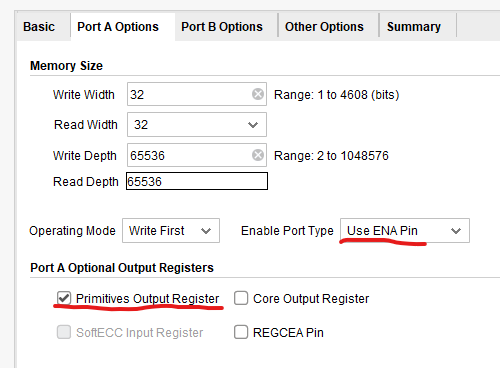
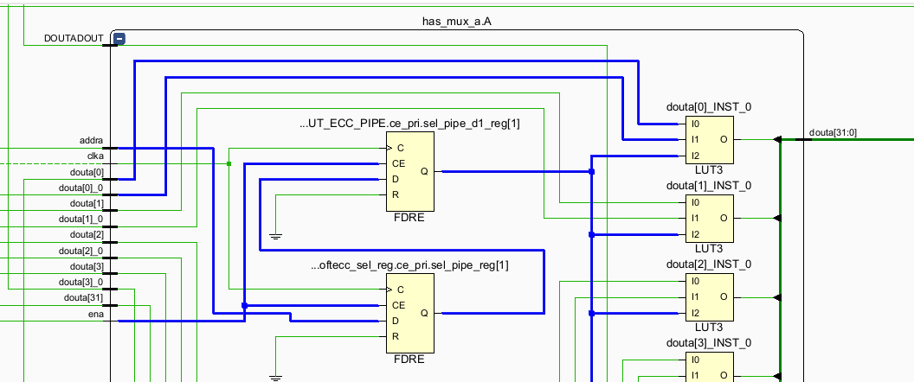
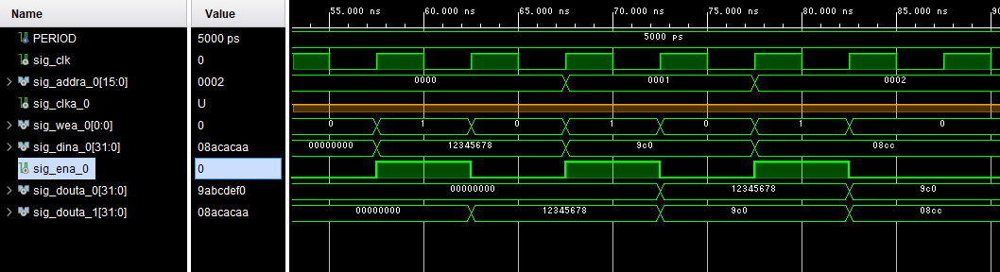
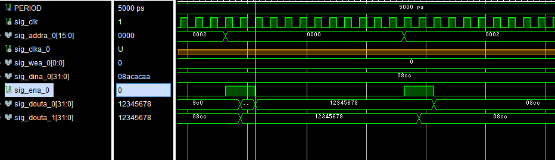
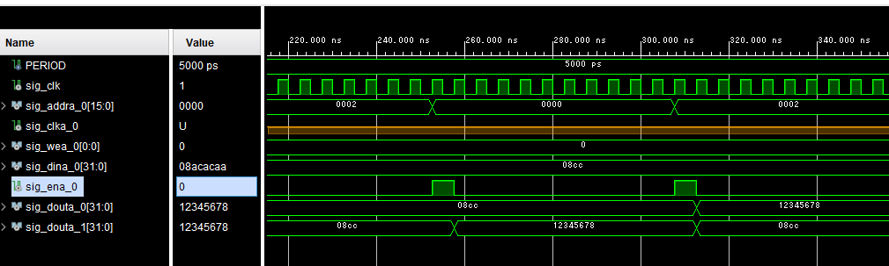

# AMD BRAM
## BRAMの注意点

### Primitibes output register
TDPRの設定で、ENAピンを使用するにチェックを入れ、  
Primitibes output registerにもチェックを入れる場合の注意点。

チェックを入れると下図のように、ENA信号は二つのレジスタのCEピンに配線されるため、
読み出し時にはENA信号は２クロック分必要となる。

下図がその例である。

まず、注意点ではないが書込みについて、  
WEAピンをアサートと、ENAピンをアサートする。  
下図では、  
- アドレス０に「0x12345678」
- アドレス１に「0x9abcdef0」
- アドレス２に「0x08acacaa」  
を書き込んでいる。  
※波形でなぜかアドレス１と２が3文字目以降が切れているがシミュレーション表示のバグ？  

書き込み  
doutが０と１の２つあるが  
0 がPrimitibes output registerにもチェックを入れるた場合  
1 がPrimitibes output registerにもチェックを外した場合  

正しい読み出し  
連続した2クロック分のENA信号により、正しく出力される。
チェックのない方だと、レジスタは1段のみのためすぐに出力されている。

間違った読み出し  
1クロックのみだと、前回の出力がまだのっこったままとなる。
チェックのない方だとレジスタは1段のみのため問題とならない。

